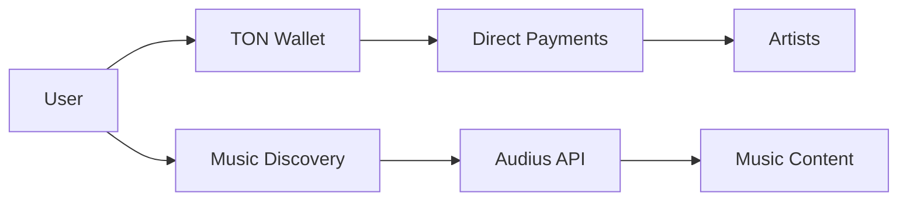

# TON × Audius Documentation

Welcome to the documentation for our Web3 music streaming platform that combines TON blockchain payments with Audius music discovery.

## Quick Links

- [🪙 Token Integration Guide](./token-integration.md) - Complete architecture overview
- [📚 API Reference](./api-reference.md) - Developer integration docs  
- [👤 User Guide](./user-guide.md) - How to use the platform
- [🔧 Support](./support.md) - Troubleshooting and help

## Platform Overview

Our platform creates a seamless bridge between:
- **TON Blockchain**: Fast, affordable payments for music creators
- **Audius Protocol**: Decentralized music streaming and discovery

## Key Features

### For Music Fans
- 🎵 Stream music from Audius's vast catalog
- 💎 Tip artists directly with TON
- 🎨 Collect exclusive music NFTs
- 🎤 Participate in live events

### For Artists
- 💰 Receive direct payments from fans
- 🎯 Reach new audiences through Audius discovery
- 🏆 Build engaged communities
- 📊 Access transparent analytics

## Architecture Highlights

## Getting Started

1. **Connect Wallet**: Link your TON wallet
2. **Explore Music**: Browse trending tracks
3. **Support Artists**: Send tips and collect NFTs
4. **Join Community**: Participate in governance

## Contributing

This documentation is maintained alongside our open-source platform. For updates or corrections, please contribute to our repository.

---

*Built with ❤️ for the future of music*